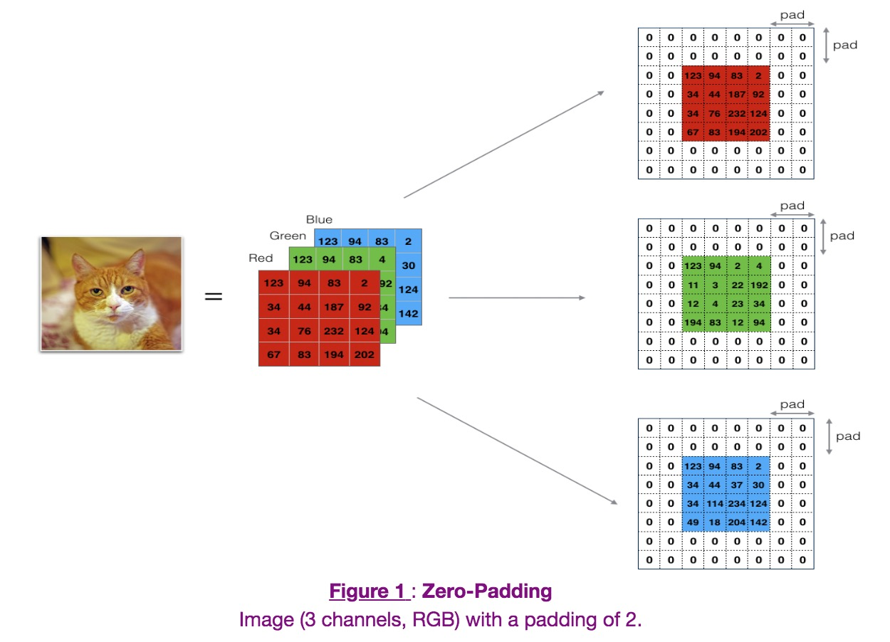
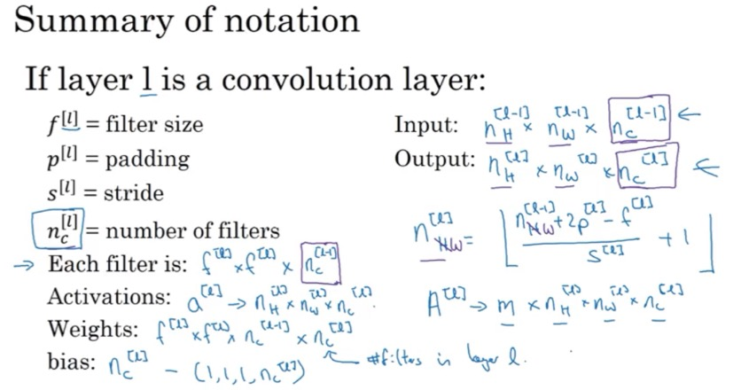
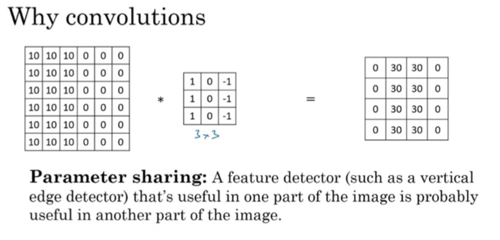

## Basics

Converlutions
- N * N   Filter: F * F
- Output: N-F+1 * N-F+1

Why Padding?
- Problems Exists
    - shrink output.
    - throw away info from edge.
    
- Valid and Same convolutions
    - valid: P = 0
    - same: pad so that output size is the same as the input size
        - N + 2P - F + 1 = N   => p = (F -1) / 2

- F is usually odd
    - P = (F-1)/2 Symmetric
    - F*F have a central pixel talk about the positon of the filter

- Advantage
    - It allows you to use a CONV layer without necessarily shrinking the height and width of the volumes. This is important for building deeper networks, since otherwise the height/width would shrink as you go to deeper layers. 
    - It helps us keep more of the information at the border of an image. Without padding, very few values at the next layer would be affected by pixels as the edges of an image.

    

