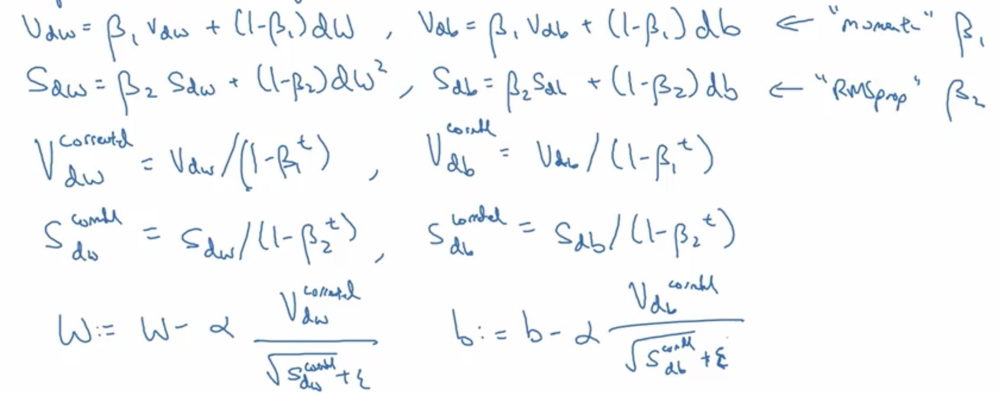

## 优化方法 optimization
偏差方向，slow; 学习方向，fast
- the path taken by mini-batch gradient descent will "oscillate" toward convergence. 
- Using momentum can reduce these oscillations.

momentum
- Momentum takes into account the past gradients to smooth out the update. 
- 梯度在水平方向快速，在竖直方向缓速
- Vdw = beta * Vdw + (1-beta) dw
- W = W - Vdw
- dw加速器，Vdw偏差不是很大
- 当beta=0.9时，差不多前十次的dw的平均
- Common values for  β  range from 0.8 to 0.999. If you don't feel inclined to tune this,  β=0.9β=0.9  is often a reasonable default.
- The larger the momentum  β  is, the smoother the update because the more we take the past gradients into account. 

RMSprop
- root mean square prop
- moving average of the squared gradient
- 

Adam 
- 
- 

优化方向
- 