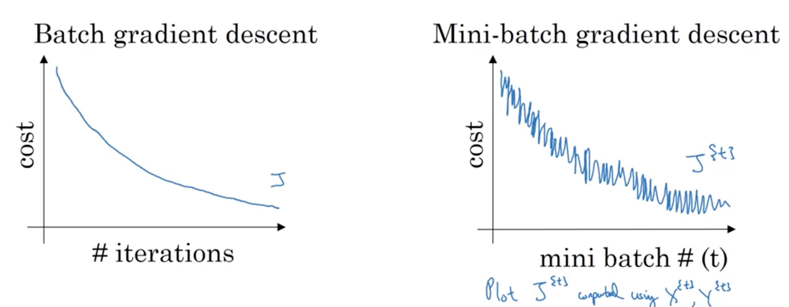
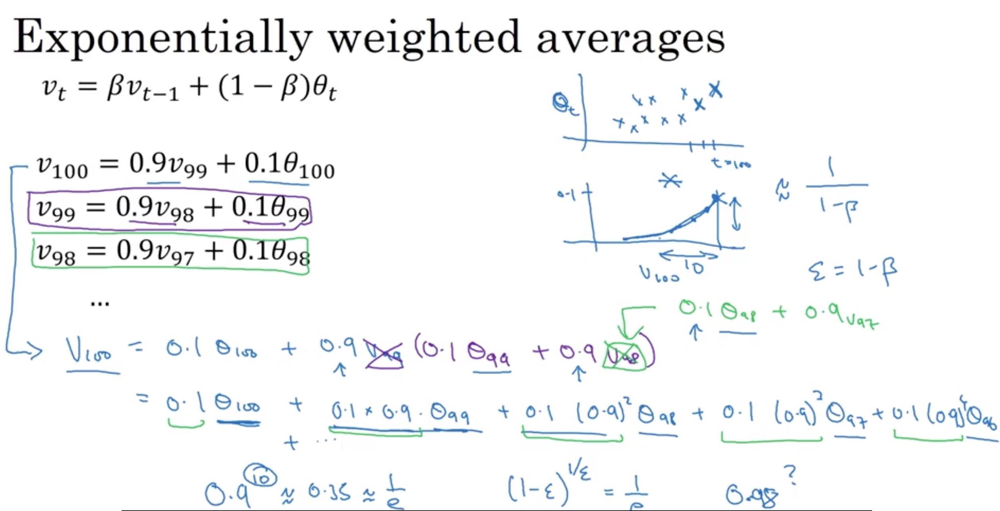

1. 权重初始化
- Xavier
    - W[l] = sqrt(1./layers_dims[l-1])
    
- He initialization
    - W[l] = sqrt(2./layers_dims[l-1]) for **layers with a ReLU activation**
    
- 全设为0
    - W都一样，更新也一样，经过一次迭代后，dW = 0, 所有的预测都一样，相当于只有一个w
    - different hidden units can learn same things
    
- 设的很大
    - tanh和sigmoid的导数约等于0, 很慢
    
    
2. 正则化
- L2
    - L2-regularization relies on the assumption that a model with small weights is simpler than a model with large weights.
    - L2 regularization makes your decision boundary smoother. If  λλ  is too large, it is also possible to "oversmooth", resulting in a model with high bias.
    - Weights end up smaller ("weight decay"): Weights are pushed to smaller values.
    
3. Dropout
- With dropout, your neurons thus become less sensitive to the activation of one other specific neuron, because that other neuron might be shut down at any time.
- Steps
    - A[l] = A[l] * D[l]
    - A[l] = A[l] / keep_prob
        - By doing this you are assuring that the result of the cost will still have the same expected value as without drop-out. 
        - This technique is also called **inverted dropout**.
- You should use dropout (randomly eliminate nodes) only in training.

4. Minibatch
- Make sure your mini-batch fit for you CPU/GPU memory
- 64, 128, 256, 512, 2^i

5. batch gradient descent 
- cost difference between mini-batch and batch gradient descent. 
- 
- 当样本很多时，很慢

6. stachostic gradient descent
- mini-batch size = 1

7. epoch
- a single pass through the training set.

8. step
- a single pass through one mini-batch

9. **Exponentially weighted average**
Vt = a Vt-1 + (1-a) Lt
- 计算多变量的平均值
- Vt 指当天的温度，Vt-1前一天的温度， Lt表示当天的温度变化
- 当a=0.9时， 1 / (1-a) = 10, 表示前十天的温度平均
- 当a=0.99时，1 / (1-a) = 100, 表示前100天的平均问题
- 

10. 调参方法
- 随机 -> 挑选表现好周围范围 -> 再随机

11. batch normalization
- before activate function
- shape = (n_l, 1)
- e_l, u_l

12. 模型内存不足
- Gradient accumulation
    - The samples in a minibatch are typically independent with respect to gradient computation (excluding batch normalization, which is not used here). This means that the gradients of multiple smaller minibatches can be accumulated before performing the weight update, and this will be exactly equivalent to a single larger update.
- Gradient checkpointing
    - The major use of GPU/TPU memory during DNN training is caching the intermediate activations in the forward pass that are necessary for efficient computation in the backward pass. "Gradient checkpointing" trades memory for compute time by re-computing the activations in an intelligent way.
    

    