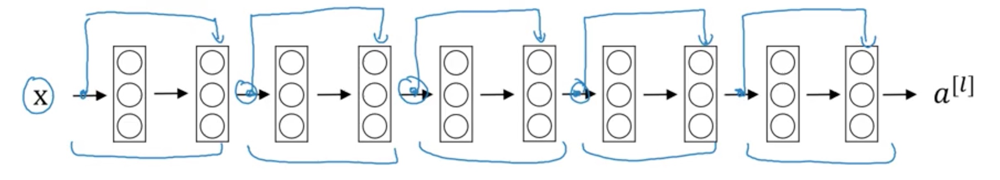

## Why CNN
- flat will lose a lot of information, eg: Spatial positioning of what’s next to what else
- Features are hierarchical
    - Composing high-complexity features out of low-complexity features is more efficient than learning high-complexity features directly.
	    - e.g.: having an “circle” detector is useful for detecting faces… and basketballs
- Features are translationally invariant
    - If a feature is useful to compute at (x, y) it is useful to compute that feature at (x’, y’) as well
- Convolutional networks are tailor-made for computer vision tasks.

## Basics

Converlutions
- N * N   Filter: F * F
- Output: N-F+1 * N-F+1
- Filter_nums = channel_input * channel_output, 每个filter对应一个channel(feature map)的映射, 
    - 比如前面16 channel, 后面36 channel, filter_size 5 * 5, 每个input channel对应36个channel, 最后形成的36个channel 是将前面16个channel汇聚？
    - Filters always extend the full depth of the input volume
- For each position of the filter, the dot-product is being calculated between the filter and the image pixels under the filter, which results in a single pixel in the output image.

Pooling
- makes the representations smaller and more manageable 
- operates over each activation map independently
- conv -> activate -> pool
- relu(max_pool(x)) == max_pool(relu(x))
- calculation
    - Input: W1 * H1 * D1   
    - Filter_size: F, Stride S
    - Output: 
        - W2 = (W1 - F)/S + 1
        - H2 = (H1 - F)/S + 1
        - D2 = D1
- tips
    - it is not common to use zero-padding for Pooling layers
    

Why Padding?
- Problems Exists
    - shrink output.
    - throw away info from edge.
    
- Valid and Same convolutions
    - valid: P = 0
    - same: pad so that output size is the same as the input size
        - N + 2P - F + 1 = N   => p = (F -1) / 2

- F is usually odd
    - P = (F-1)/2 Symmetric
    - F*F have a central pixel talk about the positon of the filter

- Advantage
    - It allows you to use a CONV layer without necessarily shrinking the height and width of the volumes. This is important for building deeper networks, since otherwise the height/width would shrink as you go to deeper layers. 
    - It helps us keep more of the information at the border of an image. Without padding, very few values at the next layer would be affected by pixels as the edges of an image.

    

## Classic CNN Papers
- LeNets. 1998. Gradient-based learning applied to document recognition. LeCun. 
    - 60000 parameters.
- AlexNets. 2012. ImageNet classification with deep convolutional neural networks.
    - 60 million parameters.
    - Local Response Normalization(LRN).
- VGG-16. 2015. Very deep convolutional networks for large-scale image recognition.
    - channel * 2, nh & hw / 2, 很规整.
    - 16 weight layers.
- ResNets. 2015. Deep residual networks for image recognition.
    - every tow layer, add before two layer.
    - 
- 2013. Network in network.

### CNN重要解释
- Dosovitskiy et al, “Striving for Simplicity: The All Convolutional Net”, ICLR Workshop 2015
    - 解释每个filter学习到的东西
    - backpropagation
- Simonyan et al, “Deep Inside Convolutional Networks: Visualising Image Classification Models and Saliency Maps”, ICLR Workshop 2014
- Yosinski et al, “Understanding Neural Networks Through Deep Visualization”, ICML DL Workshop 2015
- Nguyen et al, “Multifaceted Feature Visualization: Uncovering the Different Types of Features Learned By Each Neuron in Deep Neural Networks”, ICML Visualization for Deep Learning Workshop 2016

    

## CNN tips
- 随着层数加深，nh, nw降低，nc增大
- conv,[activation maps] activate, pool, conv, activate, pool, ..., fc, fc, ..., output
- one by one conv
    - shrinking nc
    - 
     
## Terms
- FC: full-connected layer

