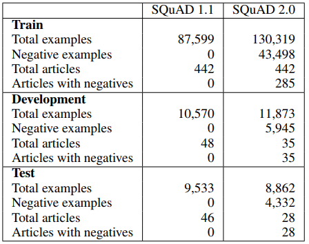
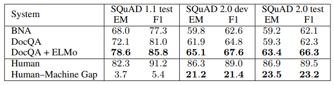

- SQuAD 2.0 [Know What You Don’t Know: Unanswerable Questions for SQuAD](https://arxiv.org/pdf/1806.03822.pdf)
    - 目的: know what they don’t know
    - 与1.1区别：
        - 新增 53,775 No answerd Questions
        - 
    - 特点： 
        - they are relevant to the paragraph.
            - 以防：Otherwise, simple heuristics (e.g., based on word overlap) could distinguish answerable and unanswerable questions
        - the paragraph contains a plausible answer —— something of the same type as what the question asks for.
            - 以防：Otherwise, type-matching heuristics could distinguish answerable and unanswerable questions.
    - 众包标注平台 Daemo crowdsourcing platform [2015 Daemo: A self-governed crowdsourcing marketplace.]
    - 做法
        - 对于SQuAD 1.1中，任何一个文档的一个段落，编写至少5个没有答案的问题(要求: 必须标注“伪答案”, 必须引用段落实体)
        - 每个段落至少花费7分钟，每小时$10.5.  
        - 每篇文档至少25个无答案问题
        - 在dev和test集中，删除未收集到无答案的文档
        - 重新找另一批标注人员回答问题，将有答案的和无答案的混合。对同一个问题，收集到的多个回答，进行投票选出，在票数一样时倾向有回答的和短回答的。
        - 平均每个问题收到4.8个回答，而1.1只收集一个答案
    - 准确性
        - 随机验证，93%的无答案的问题，确实是没有答案的
        - 对于无答案的错误回答，有一半是伪答案。【人和机器都是如此】
    - 
    - 
    
    
| Model | SQuAD 1.1 F1 | SQuAD 2.0 F1 |
| :-----: | :-----: | :-----: |
| 1.1 Best Model|  86% | 66% |

## Comprehension Datasets 
- 抽取式阅读理解数据集
    - Zero-shot Relation Extraction dataset. [2017. Zero-shot relation extraction via reading comprehension.]
        - 通过远程监督生成负样本，65%的负样本没有“看起来合理的”答案，很容易区分。 
    - TriviaQA. [2017. TriviaQA: A large scale distantly supervised challenge dataset for reading comprehension.]
        - 通过搜索引擎输入问题，得到不包含答案的文档，作为负样例，但是在最终数据集里去除？ 
    - Clark and Gardner (2017)
        - 通过将同一篇文章的不同段落和当前问题匹配，基于TF-IDF overlap值。 和相关性违背。
    - NewsQA data (2017 NewsQA: A machine comprehension dataset. )
    - RULEBASED questions.(2017  Adversarial examples for evaluating reading comprehension systems.)
        - 重写问题，导致无答案；缺点：缺乏多样性，
        - Their questions are not very diverse: they only replace entities and numbers with similar words, and replace nouns and adjectives with WordNet antonyms.
    - QASENT dataset. (2017 What is the jeopardy model? a quasi-synchronous grammar for QA.)
        - 通过对句子排序，建模一个句子比另一个句子更有可能回答该问题。
    - WikiQA. (2015 WikiQA: A challenge dataset for open-domain question answering.)
        - 通过配对Bing搜索引擎日志中的查询词和Wiki句子，不确保是否有伪答案和相关性. [3047 questions, 1473 answers]
    - MCTest. (2013 A challenge dataset for the open-domain machine comprehension of text.)
        & RACE (2017 Race: Large-scale reading comprehension dataset from examinations.)
        - multiple choice questions, which can have a “none of the above” option
    
- 生成使阅读理解数据集

- 其他数据集
    TREC 8-13 QA tracks
    
Questions: question_len <= 30
Contexts: context_len <= 400
Answers: max_span_len <= 25

http://www.parl.ai/static/docs/tasks.html#

|数据集| 描述 | 可用于 | 总样本数 | 正样本数 | 负样本数 | 链接 | 
| :-----: | :-----: | :-----:| :-----: | :-----: | :-----: | :-----: |
| Quora | 给定两个问题，是否描述一个含义 | pretrain |  404362 | 149306 | 255045 | https://www.kaggle.com/quora/question-pairs-dataset |

