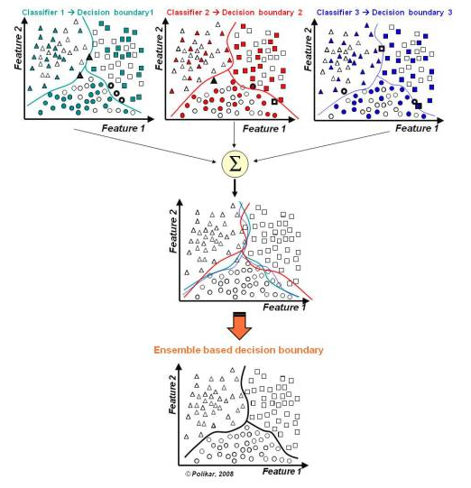

## Strategies
    
- Bagging
    - Methods
        - Voting
            - a majority voting strategy, where we take the span that is most commonly voted upon by the models. 
            - break ties by taking the span with the highest predicted joint probability p_start(i) * p_end(j)
        - Best Scores
            - for each question, pick the max p_start(i) * p_end(j) answer
        - average, sum, min, max
        
    - Strength
        - Robust against outliers and noise. 
        - Reduces variance and typically avoids overfitting.
        - Easy to use with limited well established default parameters.  Works well off the shelf requiring little additional tuning. 
        - Fast run time.
    
    - Weakness
        - Can be slow to score as complexity increases.
        - Lack of transparancy due to the complexity of multiple trees.
    
    - Examples
        - Random Forest
     
    - Suit for
        - not to situation that have a high bias
        - to situation that hava a high variance
        - deal with noise

- Boosting
    - Methods
        - Similar to Bagging but with an emphasis on improving weak learners. 
 
    - Strength
        - Often the best possible model.
        - Directly optimizes the cost function.
        
    - Weakness
        - Not robust against outliers and noise.
        - Can overfit.
        - Need to find proper stopping point.
        - Several hyper-parameters.
        - Lack of transparancy due to the complexity of multiple trees.
    
    - Examples
        - Adaboost, Gradient Boosted Models (GBM). 
     
    - Suit for
        - situation that have a high bias
        - not to situation that have a high variance
        - deal with noise
         
    

- Stacking
    - simple LR layer

## Diverse
- expose each classifier to different training data
- expose the learners to different combinations of features.
- expose different types of models, like 

## Error analysis
- Model error arises from noise, bias, and variance.
    - Noise is error by the target function.
    - Bias is where the algorithm cannot learn the target.
    - Variance comes from sampling.

## Aplication
- Regression Ensemble
- Classification Ensemble
- Span Prediction Ensemble

## Examples

## References
- [Want to Win Competitions? Pay Attention to Your Ensembles.](https://www.datasciencecentral.com/profiles/blogs/want-to-win-at-kaggle-pay-attention-to-your-ensembles)
- 