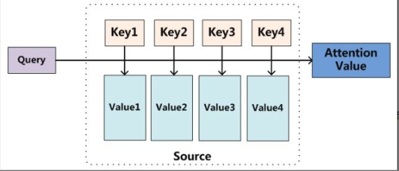

## RNN

## Attention Mechanism
- Papers
    - Neural machine translation by jointly learning to align and translate.
    - Sequence to Sequence Learning with Neural Networks.
    - Learning Phrase Representations using RNN Encoder–Decoder for Statistical Machine Translation.
    
- Links
    - [模型汇总24 - 深度学习中Attention Mechanism详细介绍：原理、分类及应用](https://zhuanlan.zhihu.com/p/31547842)
    - [深度学习中的注意力模型（2017版）](https://zhuanlan.zhihu.com/p/37601161)
    - 
    
- Attention理解
    - Attention给模型赋予了区分辨别的能力，例如，在机器翻译、语音识别应用中，为句子中的每个词赋予不同的权重，使神经网络模型的学习变得更加灵活（soft），同时Attention本身可以做为一种对齐关系，解释翻译输入/输出句子之间的对齐关系，解释模型到底学到了什么知识，为我们打开深度学习的黑箱，提供了一个窗口， 
    - 深度学习中的注意力机制从本质上讲和人类的选择性视觉注意力机制类似，核心目标也是从众多信息中选择出对当前任务目标更关键的信息。
    - 本质上Attention机制是对Source中元素的Value值进行加权求和，而Query和Key用来计算对应Value的权重系数。

- Self Attention
    - 指的不是Target和Source之间的Attention机制，而是Source内部元素之间或者Target内部元素之间发生的Attention机制，也可以理解为Target=Source这种特殊情况下的注意力计算机制。

- attention function
    - additive attention
    - dot-product(multiplicative) attention