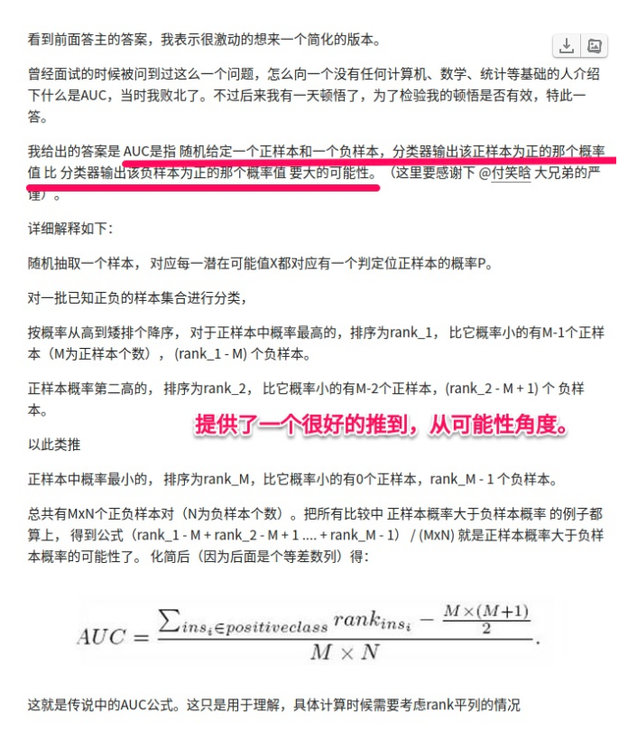

## Cos相似性
- Sc(A, B) = cos similarity = cos() = A dot B / |A| / |B|

## Cos距离
- Dc(A, B) = 1 - Sc(A, B) = cos distance = 1 - cos()
- 正向空间

## Jaccard相似性
- Js(A, B) = | A & B | / | A | B|

## Jaccard距离
- Jd(A, B) = 1 - Js(A, B) = 1 - | A & B| / | A | B |

## 混淆矩阵
| | | Group Truth||
| :---: | :---: | :---: | :---: |
|  | | 正(P) | 负(N) |
| Pred | 正(P) | TP[真阳性] | FP[假阳性] | 
| | 负(N)| FN[假阴性] | TN[真阴性] |   

## AUC
- 深入理解
    - 带着一种阈值的观点去理解(FPR，TPR)曲线[ROC  Receiver Operating Characteristic曲线]，当分类阈值为0时，所有的都是对的，对应于(1, 1), 当阈值最大时，所有的都预测为阴性，对应于(0, 0)
    - 针对预测概率，不用指定阈值.
    - [理解](https://www.zhihu.com/question/39840928)
    - 根据thredholds得到(FPR, TPR)，并绘制出曲线，得到最终的AUC
    - 用看病的例子，阴阳性，
    - 假阴性FN： 预测没病，实际有病。漏报。
    - 假阳性FP： 预测有病，实际没病。误报。
    - 真阴性TN： 预测没病，实际没病。
    - 真阳性TP： 预测有病，实际有病。
    - FPR = FP / (FP + TN) 假阳率，预测有病，实际没病，占实际没病的比例；预测为正但实际为负的样本占所有负例样本的比例；
    - TPR = TP / (TP + FN) 真阳率，预测有病，实际有病，占实际有病的比例，预测为正且实际为正的样本占所有正例样本的比例；
    - 阴阳实际的情况，真假预测的情况，预测的在前，真实的在后。
    - [实现](../helper/ml_metrics.py)
    - 本质含义：我们希望分类器达到的效果是：对于真实类别为1的样本，分类器预测为1的概率（即TPRate），要大于真实类别为0而预测类别为1的概率（即FPRate），这样的ROC曲线是在y=x之上的。
    - AUC的计算方法同时考虑了分类器对于正例和负例的分类能力，在样本不平衡的情况下，依然能够对分类器作出合理的评价。以百分比来考虑。
    - The implicit goal of AUC is to deal with situations where you have a very skewed sample distribution, and don't want to overfit to a single class.
    - 从Mann–Whitney+U+statistic的角度来解释，AUC就是从所有1样本中随机选取一个样本，+从所有0样本中随机选取一个样本，然后根据你的分类器对两个随机样本进行预测，把1样本预测为1的概率为p1，把0样本预测为1的概率为p0，p1>p0的概率就等于AUC。所以AUC反应的是分类器对样本的排序能力。&oq=从Mann–Whitney+U+statistic的角度来解释，AUC就是从所有1样本中随机选取一个样本，+从所有0样本中随机选取一个样本，然后根据你的分类器对两个随机样本进行预测，把1样本预测为1的概率为p1，把0样本预测为1的概率为p0，p1>p0的概率就等于AUC。所以AUC反应的是分类器对样本的排序能力。
    -  The AUC value is equivalent to the probability that a randomly chosen positive example is ranked higher than a randomly chosen negative example.
    - AUC是指 随机给定一个正样本和一个负样本，分类器输出该正样本为正的那个概率值 比 分类器输出该负样本为正的那个概率值 要大的可能性。
    - AUC计算主要与排序有关，所以它对排序敏感，而对预测分数不敏感。
    
    

## P-R曲线
- 精确率Precise = TP / (TP + FP), 预测为对的当中的准确率, 用来排序里面，只考虑对的情况(推荐出来的结果的情况)
- 召回率Recall = TP / (TP + FN), 召回率就是真阳率, 预测为对且真实为对，占真实为对的准确率.(推荐出来的多少)
- 以召回率R为横轴, 以精确率P为纵轴画出的P-R曲线，越靠近右上角越好，曲线下的面积叫AP分数（Average Precision Score, 平均精准度)
- 这个值不好计算，用F1来代替，F1 = 2*P*R / (P+R)
- 准确率(Accuracy) = (TP + TN) / (TP + TN + FP + FN)， 准确率可以衡量多类，精确率一般只考虑两类(推荐对的占推荐的比例)

## AUC和Accuracy区别
- AUC比较稳定，能综合考虑各种阈值, Accuracy阈值固定, 在类别不均衡时考虑AUC.
- [比较](https://datascience.stackexchange.com/questions/806/advantages-of-auc-vs-standard-accuracy)