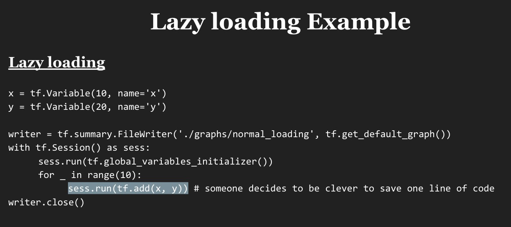
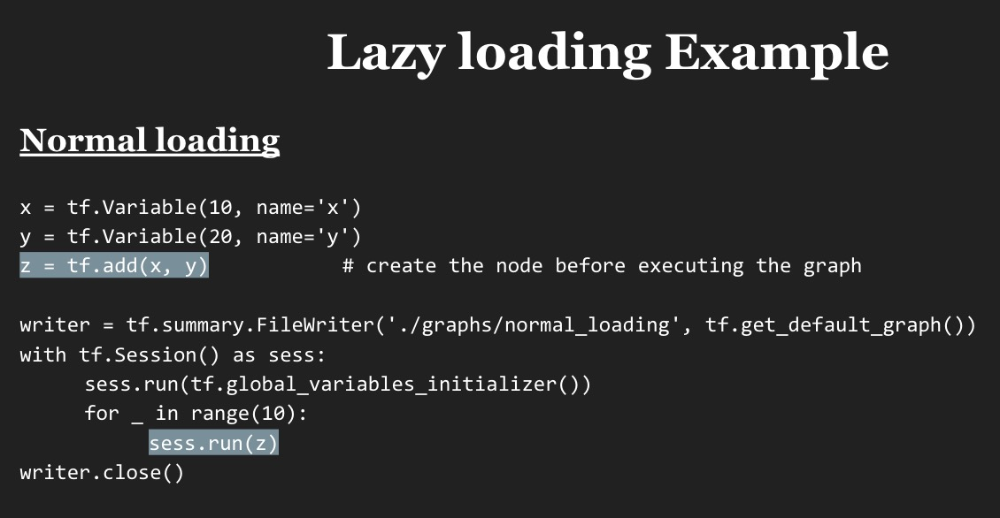

- tensorflow
    - tensor + flow = data + flow

- tensor
    - An n-dimensional array
    - data
    
- Nodes
    - operators, variables, and constants

- Edges
    - tensors

- Session
    - A Session object encapsulates the environment in which Operation objects are executed, and Tensor objects are evaluated.
    - Session will also allocate memory to store the current values of variables.
    
- Graph
    - why need Graph?
        - Save computation. Only run subgraphs that lead to the values you want to fetch.
        - Break computation into small, differential pieces to facilitate auto-differentiation
        - Facilitate distributed computation, spread the work across multiple CPUs, GPUs, TPUs, or other devices

- ops
    - constants
    - variables
    - operators

- get the value of a node
    - Create a session, assign it to variable sess so we can call it later
    - Within the session, evaluate the graph to fetch the value of a
    
    
- lazy loading
    - 先确定op, 建图，然后再执行，而不是每次执行时，增加op.
    - refers to a programming pattern when you defer declaring/initializing an object until it is loaded.
    - In the context of TensorFlow, it means you defer creating an op until you need to compute it.
    - separate the definition of ops and their execution
    - 
    - 
    
- feed_dict
    - When you have a large graph and just want to test out certain parts, you can provide dummy values so TensorFlow won't waste time doing unnecessary computations.
    - 当图很大时，可以直接给后面变量赋值，直接测试要测试的部分
    
 
- not just a library
    - TensorFlow
    - TensorBoard
    - Tensor Serving

- with other frames
    - Numpy
        - NumPy supports ndarray, but doesn't offer methods to create tensor functions and automatically compute derivatives, nor GPU support. 
